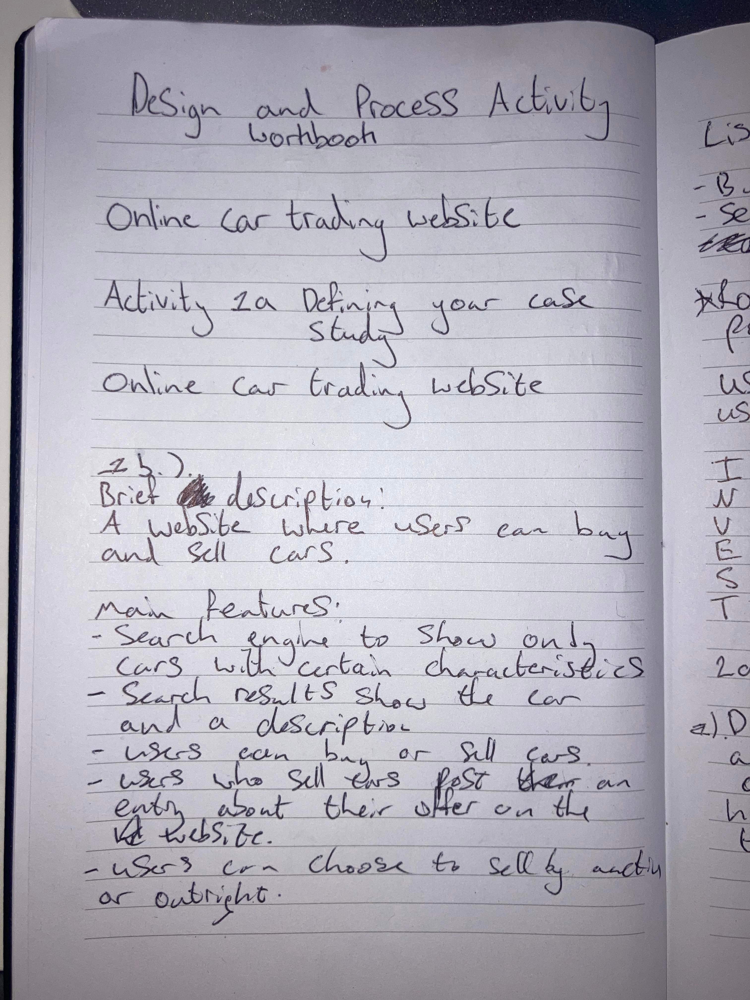
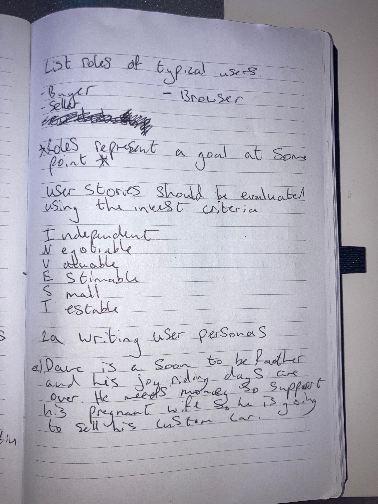
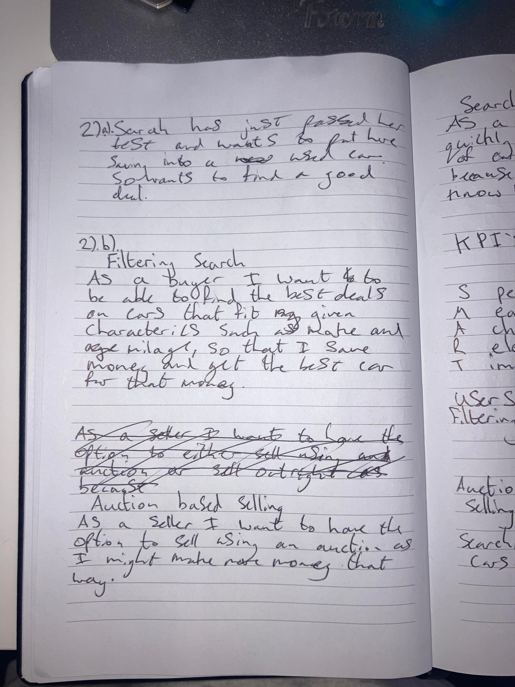
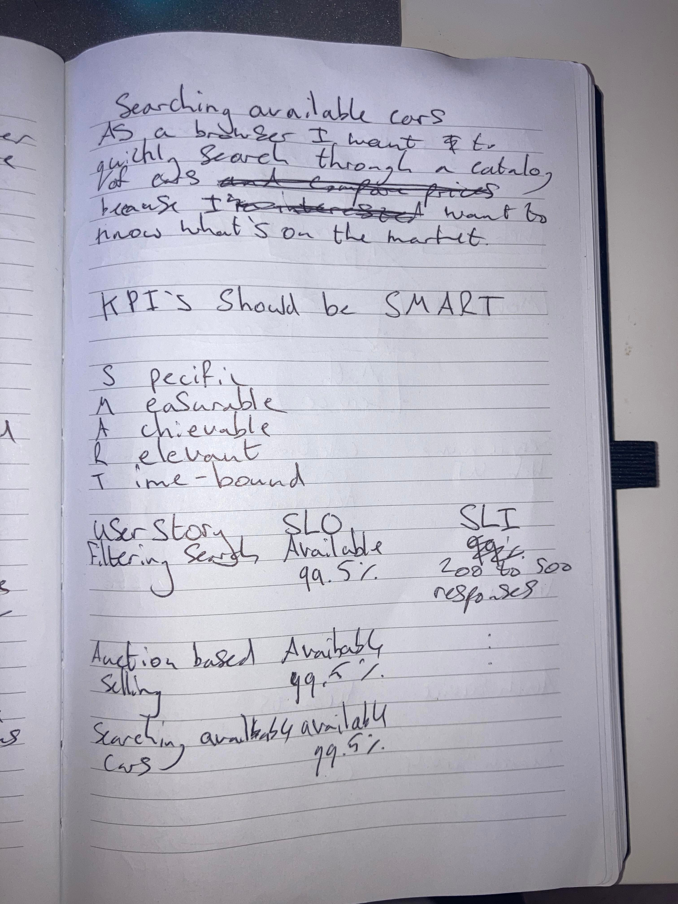
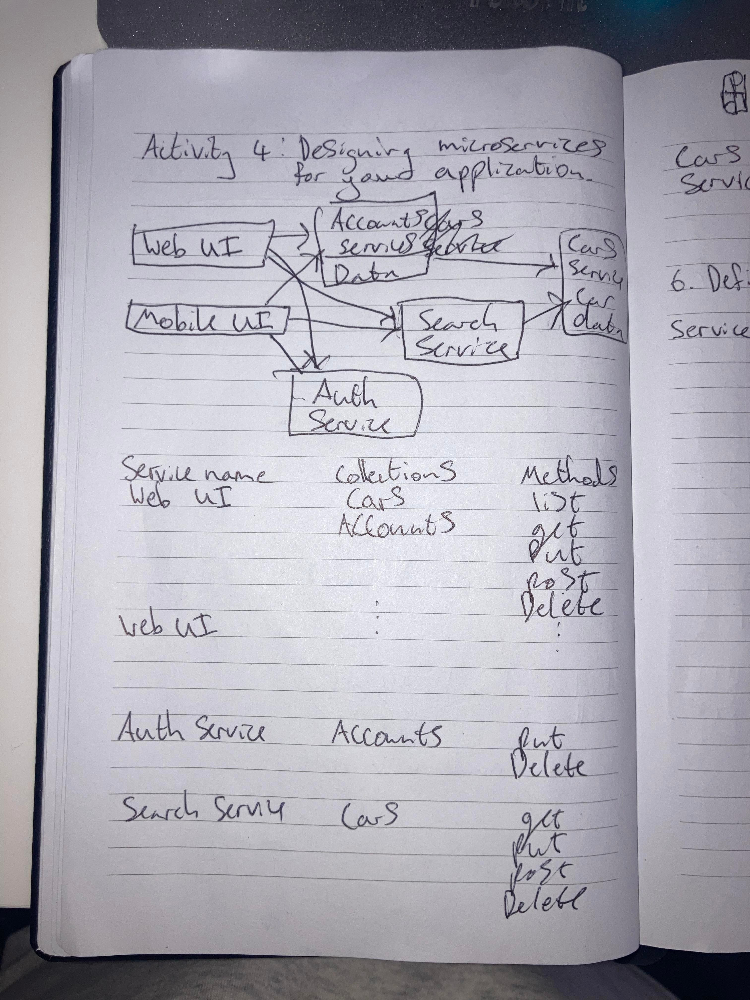
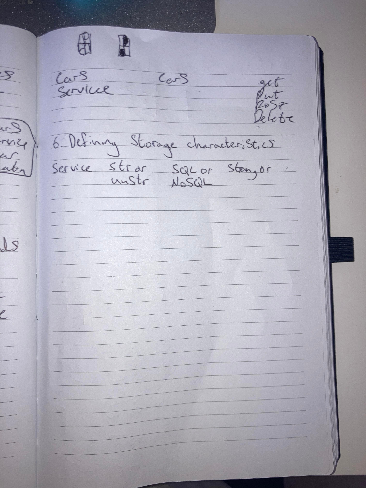

# DesignAndProcessActivities
Reliable Google Cloud Infrastructure: Design and Process - Activity log

This is a log that shows my answer to the activities for the Reliable Google Cloud Infrastructure course as well as any notes I took.

